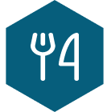

  

<h4 align="center"> 
	 Status: Under development.
</h4>

 

# Food Explorer

 

**Rocketseat's Explorer program ultimate challenge front-end application.** 

---

	<a href="#about">About</a> •
  <a href="#preview">Preview</a> •
	<a href="#tech-stack-and-tools">Tech Stack and tools</a> •
  <a href="#functionalities">Functionalities</a> •
	<a href="#utilization">Utilization</a> •
	<a href="#publication">Publication</a> •
	<a href="#author">Author</a> 

---

## About

> An application that helps at restaurant managing through an interactive menu.

Project developed as a result of the teachings learned at Rocketseat's program Explorer, a FullStack developer formation.

A Frontend application built up using ReactJS, JavaScript, Styled-components and NodeJS's NPM, among others, that allows you to sign up and sign in as a default user as well as sign in as administrator.

As the first persona you will be able to edit your profile, see all the registered dishes, add them to favorites, checking and editing this list after, see it details by clicking them, add as many itens as you want to the shopping cart and see your current and previous orders.

As the second persona you will be able to create, see/ read, edit and delete (CRUD) any dishes at any time, add them to favorites, checking and edit this list after, see and control all and each one of the requests and its statuses, as well as see all the users and assign them to administrator role as needed and wanted.

## Preview

## Tech Stack and tools

 
	
	
	
	
    
  
  
	
  
  
		
	

## Functionalities

- Register a user;
- Update user name, email, password, and avatar;
- Show the details of an specific dish;
- See/ read/ list/ index all available dishes;

	- In addition to being able to filter them by name or ingredient;

- As Administrator:

	> Do everything a default user can do and more.

	- List all users and change their personas, including them as other administrators;
	- Create, list/ read/ index and delete dishes categories;
	- Create and delete ingredients;
	- Create and delete dishes;
	- Update dish name, description, price, category, ingredients and picture;

