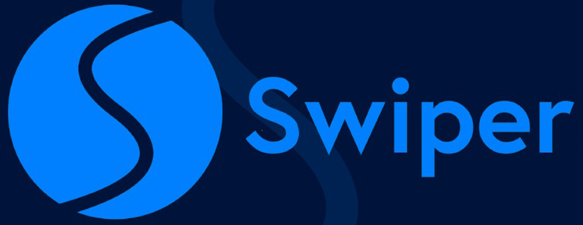

<p align="center">
  
</p>

<h4 align="center"> 
	 Status: Concluded/ Under development.
</h4>

<br/>

# Food Explorer

<br/>

**Rocketseat's Explorer program ultimate challenge front-end application.** 

---

<p align="center">
	<a href="#about">About</a> •
	<a href="#notice">Notice</a> •
  	<a href="#preview">Preview</a> •
	<a href="#tech-stack-and-tools">Tech Stack and tools</a> •
 	<a href="#functionalities">Functionalities</a> •
	<a href="#utilization">Utilization</a> •
	<a href="#publication">Publication</a> •
	<a href="#author">Author</a> 
</p>

---

## About

<br/>

> An application that helps at restaurant managing through an interactive menu.

Project developed as a result of the teachings learned at Rocketseat's program Explorer, a FullStack developer formation.

A Frontend application built up using ReactJS, JavaScript, Styled-components and NodeJS's NPM, among others, that allows you to sign up and sign in as a default user as well as sign in as administrator.

As the first persona (**default user**) you will be able to edit your profile, see all the registered dishes, add them to favorites, checking and editing this list after, see it details by clicking them, add as many itens as you want to the shopping cart and see your current and previous orders.

As the second persona (**administrator**) you will be able to create, see/ read, edit and delete (CRUD) any dishes at any time, add them to favorites, checking and edit this list after, see and control all and each one of the requests and its statuses, as well as see all the users and assign them to administrator role as needed and wanted.

## Notice

<br/>

> The project, for now, is finished, but improvements can be made at any time.

- By clicking here, you can [explore some foods](https://foodexplorerv.netlify.app/)! 

	- To try as administrator, use the login bellow:

		```bash
		"email": vinicius@email.com	
		"password": 123456
		```

**or**

- You can [clone this repository](#utilization) and execute it locally. 

**⚠️ Important!!!** 
	
	This project is using free hoisting for the backend, so there may be delays in server response time.

## Preview

<h1 align="center">
	
</h1>

<h1 align="center">
	
</h1>

### Using FIGMA

To reach this layout, based on the original project of __*Daniel Duarte*__, provided by Rocketseat, I used **FIGMA**:

 <details>

   <summary>Click here for an image preview and also access the project (by clicking on the image).</summary>
   <br/>
   <a href="https://www.figma.com/file/GGSzpJaEuWDrBLYMFuNYtx/My-food-explorer-v2?type=design&node-id=5-980&mode=design&t=ZLs6QvLs9U7NnldP-0" target="_blank"></a>

 </details>

## Tech Stack and tools

<div style="display: inline_block"><br>
	
	
	
	
    
  
  
	
  
  
	
		
		
	
</div>

## Functionalities

<h1 align="center">
	
</h1>

- [X] Performance:

	- Responsive -> Access this by Desktop or mobile;
	- Modes -> Choose between dark e light;

- [X] Register a user;
- [X] Login as default user or administrator
- [X] Update user name, email, password, and avatar;
- [X] Show the details of an specific dish;
- [X] See/ read/ list/ index all available dishes;

		In addition to being able to filter/ search them by name or ingredient;

- [X] Add dishes to a shopping cart;

	- See all added dishes:
		- Including each one's quantity, and;
		- Total cost; 
	- Remove (or add more) dishes to the cart;

- [X] Favorite your favorite dishes;

	- See/ read/ list/ index all in one list;

- [X] As Administrator:

	> Exception for favorite the dishes, do everything a default user can do and more.

	- Create dishes;
		- Creating or using existing dishes categories;
		- Creating or using existing ingredients;
	- Update dish name, description, price, category, ingredients and picture;
	- Delete dishes; 

## Utilization

<br/>

> First of all, this application is using an [specific backend API](https://github.com/Macedovin/FoodExplorer_API) which you can also clone locally following it's documentation. 

- Make a clone of this repository:

	```bash
	git clone git@github.com:Macedovin/FoodExplorer_Frontend.git
	```

- Access the repository directory:

	```bash
	$cd FoodExplorer_Frontend.git
	```

- Install all **project dependencies** by typing the command line bellow:

	```bash
	npm install
	```

- The next step is to run a command that starts a local server:

	```bash
	npm run dev
	```

**or**

## Publication

<br/>

> See this application in action! 

- [Explore some foods!](https://foodexplorerv.netlify.app/) 

**⚠️ Important!!!** 
	
	This project is using free hoisting for both backend and frontend, so there may be delays in server response time.


## Author

<br/>


Projeto criado pela [Rocketseat](https://github.com/Rocketseat) e desenvolvido por [Vinicius&nbsp;Macedo](https://github.com/Macedovin).

<a href="mailto:macedo.vp@gmail.com" target="_blank"></a>&nbsp;
<a href="https://www.linkedin.com/in/vinicius-macedop/" target="_blank"></a>&nbsp;

<br clear="left"/>
